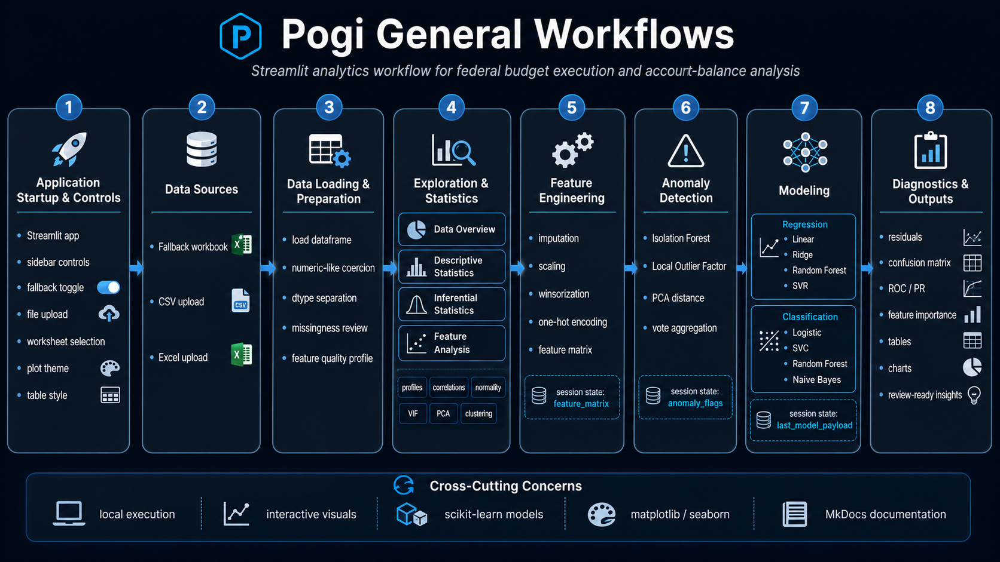



___

Pogi is organized around a practical analytical workflow for federal budget execution and
account-balance analysis. The application guides the user from data loading through data inspection,
statistical exploration, feature engineering, anomaly detection, model training, and diagnostic
review.

Each workflow stage is exposed through the Streamlit interface and supports a specific analytical
purpose. The stages are designed to work independently when needed, but they are most effective when
used in sequence.

 

## 🧭 Purpose

This page explains the major workflows in the Pogi application.

The application supports eight core workflows:

1. Application startup and global controls.
2. Data source selection.
3. Data loading and preparation.
4. Data overview and quality review.
5. Descriptive and inferential statistics.
6. Feature analysis and feature engineering.
7. Anomaly detection.
8. Modeling, diagnostics, and outputs.

Together, these workflows provide a repeatable path from raw tabular data to review-ready analytical
findings.

 
## 🧱 Workflow Overview

```
Application Startup
│
├── Configure sidebar controls
├── Select fallback or uploaded data
├── Apply table and plot preferences
│
▼
Data Sources
│
├── Fallback workbook
├── CSV upload
└── Excel upload
│
▼
Data Loading and Preparation
│
├── Load dataframe
├── Select worksheet when needed
├── Coerce numeric-like columns
├── Separate numeric and non-numeric fields
└── Prepare dataset for analysis
│
▼
Analytical Tabs
│
├── Data Overview
├── Descriptive Statistics
├── Inferential Statistics
├── Feature Analysis
├── Feature Engineering
├── Anomaly Detection
├── Modeling
└── Diagnostics
│
▼
Outputs
│
├── Tables
├── Metrics
├── Charts
├── Anomaly flags
├── Model comparisons
└── Diagnostic findings
```

 

## 🚀 Workflow 1: Application Startup and Controls

The first workflow initializes the Streamlit application and prepares the global user controls.

At startup, Pogi configures:

| Component          | Purpose                                                                                     |
| ------------------ | ------------------------------------------------------------------------------------------- |
| Page configuration | Sets the application title, layout, and icon                                                |
| Logo               | Displays the project identity                                                               |
| Header             | Presents the main Analytics Workbench title                                                 |
| Sidebar            | Exposes global controls for data loading, preview size, tables, plots, and numeric handling |
| Tabs               | Organizes the analytical workflow into major stages                                         |

The sidebar is the control center for the full application.

 

## 🎮 Global Controls

The sidebar controls determine how data is loaded, displayed, and interpreted.

| Control                       | Workflow Role                                                     |
| ----------------------------- | ----------------------------------------------------------------- |
| Use fallback data             | Loads the bundled workbook instead of requiring a user upload     |
| File uploader                 | Allows a local CSV or Excel file to be loaded                     |
| Worksheet selector            | Selects a worksheet from a multi-sheet workbook                   |
| Preview rows                  | Controls how many records appear in the preview table             |
| Use dark tables               | Controls HTML table styling                                       |
| Plot theme                    | Switches plots between light and dark rendering                   |
| Humanize large numbers        | Converts large values into readable K/M/B/T formats               |
| Include integer-coded columns | Determines whether integer fields participate in numeric analysis |

These controls should be reviewed before beginning analysis because they affect downstream tabs.

 

## 🗃️ Workflow 2: Data Source Selection

Pogi supports two primary data-source workflows.

### Fallback Data Workflow

The fallback workflow uses the local workbook included with the project.

```
Use fallback data = enabled
│
▼
Load data/excel/Account Balances.xlsx
│
▼
Continue to data preparation
```

Fallback mode is useful for demonstrations, local testing, documentation screenshots, and training.

### Uploaded Data Workflow

The upload workflow allows the user to bring a local dataset into the application.

```
Use fallback data = disabled
│
▼
Upload CSV or Excel file
│
▼
Select worksheet when applicable
│
▼
Continue to data preparation
```

Uploaded data can be a CSV file or a supported Excel workbook format.

 

## 📥 Supported File Inputs

Pogi supports common tabular formats.

| Format | Workflow Use                        |
| ------ | ----------------------------------- |
| CSV    | Simple flat-file data import        |
| XLS    | Legacy Excel workbook import        |
| XLSX   | Standard Excel workbook import      |
| XLSM   | Macro-enabled Excel workbook import |
| XLSB   | Binary Excel workbook import        |
| ODS    | OpenDocument spreadsheet import     |

The application is intended for structured tabular data where rows represent records and columns
represent features, measures, identifiers, categories, or targets.

 

## 🧹 Workflow 3: Data Loading and Preparation

After the source is selected, Pogi loads the data into a dataframe and prepares the columns for
analysis.

The preparation workflow includes:

1. Reading the source file.
2. Selecting a worksheet when needed.
3. Loading the active dataframe.
4. Coercing numeric-like text into numeric values.
5. Identifying floating-point, integer, boolean, numeric, and non-numeric columns.
6. Preparing the column lists used by all analytical tabs.

 

## 🔢 Numeric-Like Coercion

Federal budget and accounting datasets often store numeric amounts as text. Pogi attempts to convert
numeric-like object columns into numeric columns when the values are predominantly parseable.

The coercion process is designed to handle common financial formatting.

| Example Input | Interpretation               |
| ------------- | ---------------------------- |
| `1,250,000`   | Numeric amount               |
| `$450,000`    | Numeric amount               |
| `(25,000)`    | Negative amount              |
| `-`           | Placeholder or missing value |
| blank         | Missing value                |

This workflow improves downstream analysis by making numeric fields available for profiling,
statistics, feature engineering, anomaly detection, and modeling.

 

## 🧬 Column Classification Workflow

Once the dataframe is loaded and cleaned, Pogi classifies columns by type.

```
Loaded DataFrame
│
├── Floating-point columns
├── Integer columns
├── Boolean columns
├── Numeric columns
└── Non-numeric columns
```

These column groups drive the rest of the application.

| Column Group        | Used By                                                                |
| ------------------- | ---------------------------------------------------------------------- |
| Numeric columns     | Descriptive statistics, correlations, PCA, anomaly detection, modeling |
| Non-numeric columns | Group comparisons and categorical encoding                             |
| Integer columns     | Numeric analyses when enabled by the sidebar                           |
| Boolean columns     | Identified separately from continuous measures                         |

The analyst should verify inferred types before modeling.

 

## 📊 Workflow 4: Data Overview

The Data Overview workflow provides the first quality-control checkpoint.

This tab answers basic but essential questions:

1. How many rows loaded?
2. How many columns loaded?
3. How many fields are numeric?
4. How many fields are categorical?
5. Which columns have missing values?
6. Which columns are high-cardinality?
7. Which columns may be low-information?
8. Which fields may need review before modeling?

 

## 🧾 Data Overview Outputs

| Output                    | Purpose                                                              |
| ------------------------- | -------------------------------------------------------------------- |
| Row metric                | Confirms record count                                                |
| Column metric             | Confirms feature count                                               |
| Numeric column metric     | Confirms analytical measure count                                    |
| Categorical column metric | Confirms grouping or encoding candidates                             |
| Data preview              | Allows direct inspection of records                                  |
| Feature quality table     | Reviews completeness, uniqueness, cardinality, variance, and entropy |
| Missingness profile       | Identifies null-heavy fields                                         |
| Missingness chart         | Visualizes the largest missingness rates                             |

This workflow should normally be completed before descriptive statistics or modeling.

 

## 📈 Workflow 5: Descriptive Statistics

The Descriptive Statistics workflow profiles numeric fields.

It helps the analyst understand:

1. Central tendency.
2. Dispersion.
3. Quantiles.
4. Distribution shape.
5. Outlier behavior.
6. Normality assumptions.

 

## 📐 Descriptive Profile

The descriptive profile includes a broad set of measures.

| Metric Type           | Examples                                                           |
| --------------------- | ------------------------------------------------------------------ |
| Count and missingness | count, missing percentage                                          |
| Central tendency      | mean, trimmed mean, median                                         |
| Dispersion            | standard deviation, median absolute deviation, interquartile range |
| Quantiles             | minimum, first quartile, third quartile, maximum                   |
| Shape                 | skewness, kurtosis                                                 |
| Outlier indicators    | IQR outlier rate, z-score outlier rate                             |
| Normality indicators  | Shapiro p-value, D’Agostino p-value, Anderson-Darling statistic    |

This profile is useful for understanding whether variables are skewed, sparse, volatile, or
outlier-prone.

 

## 📉 Distribution Diagnostics

The Descriptive Statistics workflow includes several visual diagnostics.

| Visual      | Analytical Purpose                                |
| ----------- | ------------------------------------------------- |
| Histogram   | Shows frequency distribution                      |
| KDE curve   | Shows smoothed density                            |
| Boxplot     | Highlights median, spread, and outliers           |
| Violin plot | Shows distribution shape and density              |
| ECDF        | Shows cumulative distribution                     |
| Q-Q plot    | Compares observed values to a normal distribution |

These visuals help identify whether transformations, robust models, or outlier review may be
necessary.

 
## 🧪 Workflow 6: Inferential Statistics

The Inferential Statistics workflow tests relationships and group differences.

It supports:

1. Correlation analysis.
2. P-value review.
3. Normality testing.
4. Two-group comparisons.
5. Effect-size estimation.

 

## 🔗 Correlation Inference

Pogi supports multiple correlation methods.

| Method   | Use                                            |
| -------- | ---------------------------------------------- |
| Pearson  | Linear relationships between numeric variables |
| Spearman | Rank-based monotonic relationships             |
| Kendall  | Ordinal or rank-based associations             |

For selected numeric columns, Pogi produces:

1. A correlation matrix.
2. A p-value matrix.
3. Heatmaps for visual review.
4. A table version of the correlation results.

This workflow helps identify candidate predictors, redundant fields, and potentially meaningful
variable relationships.

 

## ⚖️ Group Comparison Workflow

When a categorical grouping field exists, Pogi can compare a numeric measure across two selected
groups.

The workflow produces:

| Test or Metric        | Purpose                                          |
| --------------------- | ------------------------------------------------ |
| Equal-variance t-test | Compares means under equal variance assumption   |
| Welch t-test          | Compares means without equal variance assumption |
| Mann-Whitney U test   | Non-parametric group comparison                  |
| Cohen’s d             | Measures standardized effect size                |
| Group histograms      | Shows distributional differences                 |
| KDE comparison        | Shows distribution-shape differences             |

This workflow helps determine whether group differences are both visible and statistically
meaningful.

 

## 🔍 Workflow 7: Feature Analysis

The Feature Analysis workflow evaluates relationships, dimensionality, clustering behavior, and
multicollinearity.

It includes:

1. Correlation heatmaps.
2. Top correlated feature pairs.
3. Principal Component Analysis.
4. k-Means clustering.
5. Variance Inflation Factor analysis.
6. Pairwise scatterplots.

 

## 🧠 PCA and Clustering Workflow

The PCA workflow transforms selected numeric features into principal components.

```
Selected numeric features
│
▼
Missing values filled with medians
│
▼
StandardScaler
│
▼
PCA projection
│
├── explained variance table
├── cumulative variance chart
└── PC1 vs PC2 scatterplot
```

The clustering workflow applies k-Means in PCA space.

```
PCA representation
│
▼
k-Means clustering
│
▼
Cluster scatterplot
```

This workflow helps determine whether records naturally group into meaningful clusters.

 

## 🧮 VIF Workflow

Variance Inflation Factor analysis identifies multicollinearity among selected numeric features.

High VIF values suggest that a feature may be strongly explained by other features. This can make
regression coefficients unstable and may complicate interpretation.

The VIF workflow is useful before building regression models or interpreting feature importance.

 

## 🛠️ Workflow 8: Feature Engineering

The Feature Engineering workflow creates the model-ready feature matrix.

Supported transformations include:

| Transformation     | Purpose                                               |
| ------------------ | ----------------------------------------------------- |
| Numeric imputation | Fills missing numeric values                          |
| kNN imputation     | Uses neighboring records to estimate missing values   |
| Scaling            | Standardizes or normalizes numeric fields             |
| Winsorization      | Clips extreme tails                                   |
| One-hot encoding   | Converts categorical variables into indicator columns |

The output is stored in session state:

```
st.session_state["feature_matrix"]
```

This output is consumed by the Modeling workflow.

 

## 🧱 Feature Matrix Workflow

The feature matrix is built as follows:

```
Selected numeric features
│
├── optional winsorization
├── imputation
└── optional scaling
        │
        ▼
Numeric matrix

Selected categorical features
        │
        ▼
One-hot encoded matrix

Numeric matrix + encoded categorical matrix
        │
        ▼
Feature matrix
        │
        ▼
st.session_state["feature_matrix"]
```

This workflow allows analysts to prepare predictors without leaving the Streamlit interface.

 

## ⚠️ Workflow 9: Anomaly Detection

The Anomaly Detection workflow flags records that may warrant further review.

Pogi uses multiple detectors and combines their results through voting.

```
Selected numeric features
│
▼
Clean numeric matrix
│
├── Isolation Forest
├── Local Outlier Factor
└── PCA distance proxy
        │
        ▼
Detector flags
        │
        ▼
Anomaly vote count
        │
        ▼
Final anomaly indicator
```

The output is stored in session state:

```
st.session_state["anomaly_flags"]
```

 

## 🧯 Anomaly Voting

Pogi does not rely on only one anomaly detector. It creates a consensus-style anomaly signal.

| Detector             | Output                    |
| -------------------- | ------------------------- |
| Isolation Forest     | `isolationforest_anomaly` |
| Local Outlier Factor | `lof_anomaly`             |
| PCA distance proxy   | `pca_far`                 |
| Vote aggregation     | `anomaly_votes`           |
| Final flag           | `is_anomaly`              |

A record is treated as an anomaly when it receives enough detector votes. This gives the analyst a
practical triage list rather than a final determination.

 

## 🤖 Workflow 10: Modeling

The Modeling workflow trains and compares regression or classification models.

The workflow uses the engineered feature matrix when available. If the feature matrix has not been
built, Pogi falls back to raw numeric features.

```
Feature matrix available?
│
├── Yes
│   └── Use st.session_state["feature_matrix"]
│
└── No
    └── Use raw numeric features
```

The user selects:

1. Target column.
2. Task type.
3. Test size.
4. Random seed.
5. Models to train.

 

## 📉 Regression Workflow

Regression is used when the target is numeric.

Available model families include:

| Model                       |
| --------------------------- |
| Linear Regression           |
| Ridge                       |
| Lasso                       |
| ElasticNet                  |
| Bayesian Ridge              |
| SGD Regressor               |
| Decision Tree Regressor     |
| Random Forest Regressor     |
| Gradient Boosting Regressor |
| Extra Trees Regressor       |
| KNeighbors Regressor        |
| SVR                         |

Regression model comparison uses:

| Metric | Purpose                            |
| ------ | ---------------------------------- |
| RMSE   | Penalizes larger prediction errors |
| MAE    | Measures average absolute error    |
| R²     | Measures explained variance        |

 

## ✅ Classification Workflow

Classification is used when the target is categorical or converted into classes.

Available model families include:

| Model                                           |
| ----------------------------------------------- |
| Logistic Regression                             |
| Linear SVC                                      |
| SVC RBF                                         |
| SGD Classifier                                  |
| Decision Tree Classifier                        |
| Random Forest Classifier                        |
| Gradient Boosting Classifier                    |
| Extra Trees Classifier                          |
| KNeighbors Classifier                           |
| Gaussian Naive Bayes                            |
| Linear Discriminant Analysis, when available    |
| Quadratic Discriminant Analysis, when available |

Classification model comparison uses accuracy as the primary ranking metric in the current workflow.

 

## 🧠 Model Payload Workflow

After training, Pogi identifies the best available model and stores a diagnostics payload.

```
Model training
│
▼
Model comparison table
│
▼
Select best model
│
▼
st.session_state["last_model_payload"]
```

The payload contains:

| Payload Field   | Purpose                      |
| --------------- | ---------------------------- |
| `task`          | Regression or classification |
| `best_name`     | Name of the selected model   |
| `best_model`    | Fitted estimator             |
| `X_test`        | Test features                |
| `y_test`        | Actual test target values    |
| `preds`         | Model predictions            |
| `feature_names` | Feature labels               |
| `X_train`       | Training features            |
| `y_train`       | Training target values       |

The Diagnostics workflow depends on this payload.

 

## 🧾 Workflow 11: Diagnostics

The Diagnostics workflow evaluates the best trained model.

If no model has been trained, the Diagnostics tab prompts the user to train models first.

```
last_model_payload exists?
│
├── No
│   └── Prompt user to train a model
│
└── Yes
    └── Render diagnostics for best model
```

 

## 📊 Regression Diagnostics

For regression models, Pogi displays:

| Diagnostic             | Purpose                                            |
| ---------------------- | -------------------------------------------------- |
| Residuals vs predicted | Detects nonlinearity, bias, and heteroskedasticity |
| Residual histogram     | Shows residual distribution                        |
| Residual Q-Q plot      | Reviews residual normality                         |
| Permutation importance | Estimates feature contribution                     |

Regression diagnostics help determine whether a model is reliable, biased, or potentially
misspecified.

 

## 📋 Classification Diagnostics

For classification models, Pogi displays:

| Diagnostic             | Purpose                                        |
| ---------------------- | ---------------------------------------------- |
| Confusion matrix       | Shows correct and incorrect predictions        |
| Classification report  | Shows precision, recall, F1 score, and support |
| ROC curve              | Evaluates binary classifier discrimination     |
| Precision-recall curve | Evaluates performance under class imbalance    |
| Permutation importance | Estimates feature contribution                 |

Classification diagnostics help determine whether a model performs well across classes and whether
errors are concentrated in specific categories.

 

## 🔄 Cross-Workflow State Contract

Several workflows produce outputs that later workflows consume.

| State Key            | Created By          | Used By        | Purpose                                           |
| -------------------- | ------------------- | -------------- | ------------------------------------------------- |
| `feature_matrix`     | Feature Engineering | Modeling       | Stores model-ready predictors                     |
| `anomaly_flags`      | Anomaly Detection   | Analyst review | Stores detector outputs and final anomaly flags   |
| `last_model_payload` | Modeling            | Diagnostics    | Stores fitted model and test data for diagnostics |

This state contract should be preserved during development.

 

## 🏛️ Budget Analysis Use Cases

The Pogi workflows support several budget-analysis use cases.

| Use Case                           | Relevant Workflows                                            |
| ---------------------------------- | ------------------------------------------------------------- |
| Budget execution review            | Data Overview, Descriptive Statistics, Feature Analysis       |
| SF-133 exploration                 | Data Loading, Statistics, Modeling                            |
| TAS-level analysis                 | Feature Analysis, Anomaly Detection, Modeling                 |
| Audit preparation                  | Missingness, Feature Quality, Anomaly Detection, Diagnostics  |
| Spend-out analysis                 | Regression Modeling, Residual Diagnostics                     |
| Classification of account behavior | Classification Modeling, Confusion Matrix, Feature Importance |
| Data-quality review                | Data Overview, Missingness, Feature Quality                   |
| Outlier triage                     | Descriptive Statistics, Anomaly Detection                     |

 

## ✅ Recommended End-to-End Sequence

Use this sequence for a complete Pogi analysis:

1. Start the application.
2. Select fallback data or upload a file.
3. Confirm the correct dataframe loaded.
4. Review the Data Overview tab.
5. Inspect missingness and feature quality.
6. Review descriptive statistics and distributions.
7. Run inferential statistics where appropriate.
8. Use Feature Analysis to inspect correlation, PCA, clustering, and VIF.
9. Build a feature matrix.
10. Run anomaly detection.
11. Train regression or classification models.
12. Review diagnostics.
13. Record findings for further review or validation.

 

## ⚠️ Workflow Limitations

Pogi is an exploratory analytics workbench. It should not be treated as an official financial system
of record.

| Limitation                           | Practical Meaning                                     |
| ------------------------------------ | ----------------------------------------------------- |
| Flexible schema                      | Analyst must validate columns and data types          |
| Local session state                  | Outputs are not automatically persisted               |
| Single-file application              | Source is easy to inspect but harder to test at scale |
| Model comparison is exploratory      | Results require analyst validation                    |
| Anomaly detection is triage-oriented | Flags are not final audit findings                    |
| Uploaded data quality varies         | Poor source data can produce misleading outputs       |

The application supports analysis, but final decisions should be validated against authoritative
budget and accounting systems.

 

## 📌 Summary

Pogi’s application workflows move the analyst from data loading to review-ready analytical outputs.
The workflow begins with file selection and data preparation, then proceeds through quality review,
descriptive statistics, inferential statistics, feature analysis, feature engineering, anomaly
detection, modeling, and diagnostics.

The recommended approach is sequential: validate the dataset first, understand the distributions and
relationships second, engineer features third, and only then run anomaly detection or model
training. This structure keeps the analysis disciplined, explainable, and easier to validate.
