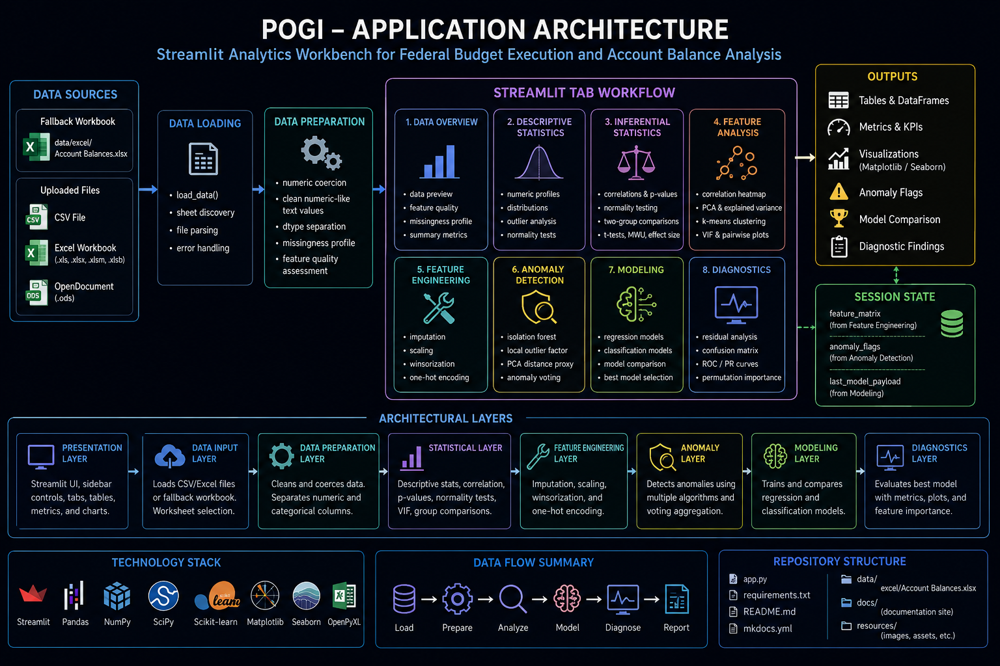




___

Pogi is a Streamlit-based analytics workbench for exploring, profiling, engineering, modeling, and
diagnosing federal budget execution data. The application is organized around a single interactive
`app.py` workflow that loads tabular data, prepares numeric and categorical features, performs
statistical analysis, runs anomaly detection, trains regression or classification models, and
presents diagnostics through Streamlit tables and Matplotlib/Seaborn visualizations.

The current architecture is intentionally direct. The application keeps the user interface,
analytical helpers, model orchestration, and visualization workflow in one Streamlit entry point.
This keeps the project easy to run and inspect while still supporting a structured MkDocs
documentation site.

 

## 🧭 Purpose

The architecture supports a practical budget-analysis workflow:

1. Load CSV or Excel data.
2. Coerce numeric-like fields into usable numeric types.
3. Inspect feature quality and missingness.
4. Run descriptive and inferential statistics.
5. Analyze relationships, dimensionality, and multicollinearity.
6. Build engineered feature matrices.
7. Detect potential anomalies.
8. Train regression or classification models.
9. Review model diagnostics and feature importance.

Pogi is built for exploratory analysis, forecasting support, fiscal behavior review, anomaly
detection, and model comparison over structured financial datasets such as SF-133, Treasury Account
Symbol, File A, or other account-balance data.

 

## 🧱 System Overview

```
┌──────────────────────────────────────────────────────────────────────────────┐
│                                  Pogi                                        │
│                     Streamlit Analytics Workbench                            │
└──────────────────────────────────────────────────────────────────────────────┘

        ┌──────────────────────┐
        │   Data Sources        │
        │──────────────────────│
        │ CSV Upload            │
        │ Excel Upload          │
        │ Worksheet Selection   │
        │ Fallback Workbook     │
        └──────────┬───────────┘
                   │
                   ▼
        ┌──────────────────────┐
        │   Data Loading        │
        │──────────────────────│
        │ load_data             │
        │ sheet discovery       │
        │ local file parsing    │
        └──────────┬───────────┘
                   │
                   ▼
        ┌──────────────────────┐
        │ Data Preparation      │
        │──────────────────────│
        │ numeric coercion      │
        │ dtype separation      │
        │ missingness profile   │
        │ feature quality       │
        └──────────┬───────────┘
                   │
                   ▼
        ┌──────────────────────────────────────────────────────────────┐
        │                    Streamlit Tab Workflow                    │
        │──────────────────────────────────────────────────────────────│
        │ Data Overview                                                │
        │ Descriptive Statistics                                       │
        │ Inferential Statistics                                       │
        │ Feature Analysis                                             │
        │ Feature Engineering                                          │
        │ Anomaly Detection                                            │
        │ Modeling                                                     │
        │ Diagnostics                                                  │
        └──────────┬───────────────────────────────────────────────────┘
                   │
                   ▼
        ┌──────────────────────┐
        │   Outputs             │
        │──────────────────────│
        │ tables                │
        │ metrics               │
        │ plots                 │
        │ anomaly flags         │
        │ model comparison      │
        │ diagnostics payload   │
        └──────────────────────┘
```

 

## 🧩 Application Layers

| Layer                     | Responsibility                                                         | Primary Components                                                         |
| ------------------------- | ---------------------------------------------------------------------- | -------------------------------------------------------------------------- |
| Presentation Layer        | Displays controls, tabs, tables, metrics, and charts                   | Streamlit sidebar, tabs, `st.data_editor`, `st.pyplot`                     |
| Data Input Layer          | Loads local CSV/Excel data or fallback workbook                        | `load_data`, `_get_uploaded_sheet_names`                                   |
| Data Preparation Layer    | Converts numeric-like fields and separates numeric/categorical columns | `_coerce_numeric_like_columns`, dtype detection                            |
| Utility Layer             | Formats numbers, improves plot readability, extracts numeric arrays    | `_humanize_number`, `_apply_plain_ticks`, `_safe_numeric_series`           |
| Statistical Layer         | Computes profiles, correlations, p-values, VIF, and normality tests    | `feature_quality`, `descriptive_profile`, `corr_with_pvalues`, `vif_table` |
| Feature Engineering Layer | Builds a model-ready feature matrix                                    | imputation, scaling, winsorization, one-hot encoding                       |
| Anomaly Layer             | Detects suspicious observations through multiple detectors             | Isolation Forest, Local Outlier Factor, PCA distance                       |
| Modeling Layer            | Trains and compares regression/classification estimators               | scikit-learn model families                                                |
| Diagnostics Layer         | Evaluates trained models and feature importance                        | residuals, confusion matrix, ROC/PR curves, permutation importance         |

 

## 🗂️ Source Organization

Pogi currently uses a single-file application structure.

```
Pogi/
├── app.py
├── requirements.txt
├── README.md
├── resources/
├── data/
│   └── excel/
│       └── Account Balances.xlsx
├── docs/
│   ├── index.md
│   ├── architecture.md
│   ├── data-sources.md
│   ├── development.md
│   ├── user-guide/
│   ├── api/
│   └── assets/
└── mkdocs.yml
```

The Streamlit application is contained in `app.py`. The documentation site is contained under
`docs/` and rendered through MkDocs Material.

 

## 🔄 Runtime Flow

### 1. Application startup

At startup, Pogi configures the Streamlit page, logo, favicon, global styles, and sidebar controls.

The global controls determine:

| Control                       | Purpose                                                |
| ----------------------------- | ------------------------------------------------------ |
| Use fallback data             | Loads the bundled workbook instead of an uploaded file |
| File uploader                 | Accepts CSV and supported Excel workbook formats       |
| Worksheet selector            | Allows worksheet selection for multi-sheet workbooks   |
| Preview rows                  | Controls displayed preview volume                      |
| Dark tables                   | Controls dark table rendering                          |
| Plot theme                    | Switches Matplotlib between light and dark styles      |
| Humanize large numbers        | Displays large numeric values with K/M/B/T suffixes    |
| Include integer-coded columns | Includes integer columns in numeric analysis           |

 

### 2. Data loading

The data loading path supports two operating modes.

```
Fallback Mode
└── data/excel/Account Balances.xlsx

Upload Mode
├── .csv
├── .xls
├── .xlsx
├── .xlsm
├── .xlsb
└── .ods
```

After data is loaded, Pogi attempts to promote object/string columns that are predominantly numeric
into real numeric columns. This helps budget and accounting data where values may arrive as strings
with commas, dollar signs, parentheses, blanks, or dash placeholders.

 

### 3. Data typing

After numeric coercion, Pogi separates the dataframe columns into:

```
float_cols
int_cols
bool_cols
numeric_cols
non_numeric_cols
```

These lists drive the tab controls and determine which features are eligible for descriptive
statistics, correlations, feature engineering, anomaly detection, modeling, and diagnostics.

 

## 🧪 Analytical Workflow

### Data Overview

The Data Overview tab provides the first quality-control checkpoint.

| Output                   | Purpose                                                                  |
| ------------------------ | ------------------------------------------------------------------------ |
| Row count                | Confirms record volume                                                   |
| Column count             | Confirms feature volume                                                  |
| Numeric column count     | Confirms available quantitative fields                                   |
| Categorical column count | Confirms available grouping fields                                       |
| Data preview             | Allows direct inspection of imported records                             |
| Feature quality          | Shows completeness, uniqueness, cardinality ratio, variance, and entropy |
| Missingness profile      | Identifies columns with null values                                      |
| Missingness chart        | Visualizes the largest missingness rates                                 |

This tab is the recommended first stop before modeling.

 

### Descriptive Statistics

The Descriptive Statistics tab computes rich numeric profiles for selected fields.

| Metric Group     | Examples                              |
| ---------------- | ------------------------------------- |
| Central tendency | mean, trimmed mean, median            |
| Dispersion       | standard deviation, MAD, IQR          |
| Quantiles        | min, q1, q3, max, percentiles         |
| Shape            | skewness, kurtosis                    |
| Outlier rates    | IQR outliers, z-score outliers        |
| Normality        | Shapiro, D’Agostino, Anderson-Darling |

The tab also provides histograms, KDE curves, boxplots, violin plots, ECDF charts, and Q-Q plots.

 

### Inferential Statistics

The Inferential Statistics tab supports statistical relationship testing.

| Capability           | Purpose                                           |
| -------------------- | ------------------------------------------------- |
| Pearson correlation  | Linear association                                |
| Spearman correlation | Rank-based monotonic association                  |
| Kendall correlation  | Ordinal association                               |
| P-value matrix       | Statistical significance review                   |
| Normality testing    | Distributional assumption testing                 |
| Two-group comparison | Mean/median comparison between categorical groups |
| t-tests              | Equal variance and Welch tests                    |
| Mann-Whitney U       | Non-parametric two-group comparison               |
| Cohen’s d            | Effect size estimation                            |

This tab helps analysts move beyond descriptive summaries and assess whether observed differences or
relationships are statistically meaningful.

 

### Feature Analysis

The Feature Analysis tab focuses on relationships and dimensionality.

| Analysis               | Purpose                                             |
| ---------------------- | --------------------------------------------------- |
| Correlation heatmap    | Identify highly related numeric features            |
| Top correlated pairs   | Rank strongest feature relationships                |
| PCA explained variance | Evaluate dimensionality reduction potential         |
| PCA projection         | Visualize observations in principal-component space |
| k-Means clustering     | Explore natural grouping patterns                   |
| VIF table              | Detect multicollinearity                            |
| Pairwise scatterplots  | Inspect bivariate relationships                     |

This tab supports feature selection, multicollinearity review, and early modeling decisions.

 

### Feature Engineering

The Feature Engineering tab builds the model-ready feature matrix.

| Transformation       | Implementation                                   |
| -------------------- | ------------------------------------------------ |
| Numeric imputation   | `SimpleImputer`                                  |
| kNN imputation       | `KNNImputer`                                     |
| Scaling              | `StandardScaler`, `MinMaxScaler`, `RobustScaler` |
| Winsorization        | Tail clipping through `winsorize`                |
| Categorical encoding | One-hot encoding with `pandas.get_dummies`       |

The engineered matrix is stored in Streamlit session state:

```
st.session_state["feature_matrix"]
```

The Modeling tab consumes this matrix when available. If the matrix is not available, the Modeling
tab falls back to raw numeric features.

 

### Anomaly Detection

The Anomaly Detection tab flags potential anomalous records using multiple detectors.

```
Isolation Forest
        │
        ├── isolationforest_anomaly
        │
Local Outlier Factor
        │
        ├── lof_anomaly
        │
PCA Distance Proxy
        │
        ├── pca_far
        │
        ▼
Anomaly Vote Aggregation
        │
        ├── anomaly_votes
        └── is_anomaly
```

A record is flagged as an anomaly when it receives at least two anomaly votes.

The anomaly output is stored in:

```
st.session_state["anomaly_flags"]
```

This design avoids relying on a single detector and gives the analyst a simple consensus-based
review flag.

 

### Modeling

The Modeling tab supports both regression and classification.

#### Regression models

| Model                       |
| --------------------------- |
| Linear Regression           |
| Ridge                       |
| Lasso                       |
| ElasticNet                  |
| Bayesian Ridge              |
| SGD Regressor               |
| Decision Tree Regressor     |
| Random Forest Regressor     |
| Gradient Boosting Regressor |
| Extra Trees Regressor       |
| KNeighbors Regressor        |
| SVR                         |

#### Classification models

| Model                                           |
| ----------------------------------------------- |
| Logistic Regression                             |
| Linear SVC                                      |
| SVC RBF                                         |
| SGD Classifier                                  |
| Decision Tree Classifier                        |
| Random Forest Classifier                        |
| Gradient Boosting Classifier                    |
| Extra Trees Classifier                          |
| KNeighbors Classifier                           |
| Gaussian Naive Bayes                            |
| Linear Discriminant Analysis, when available    |
| Quadratic Discriminant Analysis, when available |

The Modeling tab stores the best model payload in:

```
st.session_state["last_model_payload"]
```

That payload is consumed by the Diagnostics tab.

 

### Diagnostics

The Diagnostics tab depends on a trained model payload.

For regression models, it displays:

| Diagnostic             | Purpose                                              |
| ---------------------- | ---------------------------------------------------- |
| Residuals vs predicted | Detect heteroskedasticity and model misspecification |
| Residual histogram     | Inspect residual distribution                        |
| Residual Q-Q plot      | Evaluate approximate normality                       |
| Permutation importance | Estimate feature contribution                        |

For classification models, it displays:

| Diagnostic             | Purpose                                       |
| ---------------------- | --------------------------------------------- |
| Confusion matrix       | Inspect correct and incorrect classifications |
| Classification report  | Review precision, recall, F1, and support     |
| ROC curve              | Evaluate binary classifier discrimination     |
| Precision-recall curve | Evaluate performance under class imbalance    |
| Permutation importance | Estimate feature contribution                 |

 

## 🧠 Session State Contract

Pogi uses Streamlit session state to pass outputs between tabs.

| Session Key          | Producer                | Consumer                               | Purpose                                         |
| -------------------- | ----------------------- | -------------------------------------- | ----------------------------------------------- |
| `feature_matrix`     | Feature Engineering tab | Modeling tab                           | Stores engineered features for model training   |
| `anomaly_flags`      | Anomaly Detection tab   | User review / potential downstream use | Stores anomaly vote outputs                     |
| `last_model_payload` | Modeling tab            | Diagnostics tab                        | Stores best trained model and diagnostic inputs |

This contract is important because Streamlit tabs are executed in a shared application session.
Later tabs rely on state created by earlier actions.

 

## 🧮 Data Architecture

Pogi expects tabular data with a mix of numeric and categorical fields.

```
Input DataFrame
│
├── Numeric-like object columns
│   └── cleaned and coerced when parse ratio meets threshold
│
├── Numeric columns
│   ├── descriptive statistics
│   ├── correlations
│   ├── feature engineering
│   ├── anomaly detection
│   └── modeling
│
└── Non-numeric columns
    ├── grouping variables
    ├── two-group comparisons
    └── one-hot encoded features
```

The application does not require a fixed schema. This makes it flexible for exploratory analysis,
but it also means analysts should validate inferred types before training models.

 

## 📊 Visualization Architecture

Pogi uses Streamlit for layout and Matplotlib/Seaborn for visualization.

| Visualization Type | Library                   | Used For                                       |
| ------------------ | ------------------------- | ---------------------------------------------- |
| Metrics            | Streamlit                 | Row, column, feature counts                    |
| Editable tables    | Streamlit                 | Data preview, profiles, model outputs          |
| Histograms         | Seaborn / Matplotlib      | Distribution analysis                          |
| KDE plots          | Seaborn                   | Density comparison                             |
| Boxplots           | Seaborn                   | Outlier review                                 |
| Violin plots       | Seaborn                   | Distribution shape                             |
| ECDF plots         | Seaborn                   | Empirical cumulative distributions             |
| Heatmaps           | Seaborn                   | Correlation and p-value matrices               |
| Scatterplots       | Matplotlib                | PCA, pairwise features, residuals              |
| Bar charts         | Matplotlib                | Missingness, anomaly votes, feature importance |
| Q-Q plots          | SciPy / Matplotlib        | Normality diagnostics                          |
| ROC/PR curves      | scikit-learn / Matplotlib | Classification diagnostics                     |

Plot formatting is centralized through helper functions that apply readable ticks, gridlines, and
spine styling.

 

## 🏛️ Government Budget Analysis Positioning

Pogi is designed around financial, budgetary, and account-level analytics.

| Use Case                           | Architectural Support                                       |
| ---------------------------------- | ----------------------------------------------------------- |
| Budget execution review            | Data overview, descriptive statistics, missingness analysis |
| SF-133 trend exploration           | Numeric profiling, correlations, modeling                   |
| Treasury Account Symbol analysis   | Feature selection, modeling, diagnostics                    |
| Anomaly detection                  | Isolation Forest, LOF, PCA-distance voting                  |
| Audit preparation                  | Outlier tables, feature quality, model diagnostics          |
| Spend-out analysis                 | Regression modeling and residual diagnostics                |
| Classification of account behavior | Classification models and confusion matrix review           |

Pogi is not an authoritative financial system of record. It is an analytical workbench intended to
help analysts inspect data, test hypotheses, compare models, and identify records that warrant
further review.

 

## 📚 Documentation Architecture

The MkDocs documentation site is organized around the application workflow.

```
docs/
├── index.md
├── architecture.md
├── data-sources.md
├── development.md
├── user-guide/
│   ├── index.md
│   ├── installation.md
│   ├── data-loading.md
│   ├── data-overview.md
│   ├── descriptive-statistics.md
│   ├── inferential-statistics.md
│   ├── feature-analysis.md
│   ├── feature-engineering.md
│   ├── anomaly-detection.md
│   ├── modeling.md
│   └── diagnostics.md
├── api/
│   ├── index.md
│   └── app.md
└── assets/
    ├── css/
    │   └── pogi.css
    └── js/
        └── pogi.js
```

The documentation model has three purposes:

1. Explain the analytical workflow to end users.
2. Document the source-generated API from Python docstrings.
3. Provide development and deployment guidance for maintaining the project.

 

## 🔌 Dependency Architecture

Pogi relies on a compact scientific Python stack.

| Dependency         | Role                                                |
| ------------------ | --------------------------------------------------- |
| Streamlit          | Web application framework                           |
| pandas             | Dataframe operations                                |
| numpy              | Numeric computation                                 |
| scipy              | Statistical tests and probability plots             |
| scikit-learn       | Modeling, preprocessing, anomaly detection, metrics |
| matplotlib         | Base plotting                                       |
| seaborn            | Statistical plotting                                |
| openpyxl           | Excel workbook support                              |
| mkdocs             | Static documentation site generator                 |
| mkdocs-material    | Documentation theme                                 |
| mkdocstrings       | Source-generated API documentation                  |
| pymdown-extensions | Markdown extensions                                 |

 

## 🛡️ Design Strengths

| Strength                                  | Value                                                                 |
| ----------------------------------------- | --------------------------------------------------------------------- |
| Single entry point                        | Easy to run and inspect                                               |
| Local execution                           | Keeps analysis within the user’s environment                          |
| Flexible schema                           | Works with many tabular datasets                                      |
| Multiple model families                   | Supports broad model comparison                                       |
| Statistical and machine-learning workflow | Combines traditional statistics with predictive modeling              |
| Session-state handoff                     | Connects feature engineering, modeling, and diagnostics               |
| Dark-mode documentation support           | Produces readable documentation consistent with the application style |

 

## ⚠️ Architectural Constraints

| Constraint                    | Impact                                                | Recommended Future Improvement                     |
| ----------------------------- | ----------------------------------------------------- | -------------------------------------------------- |
| Single large `app.py`         | Harder to test and document as the application grows  | Split helpers into modules                         |
| Top-level Streamlit execution | May complicate mkdocstrings imports                   | Move pure helpers into a documentation-safe module |
| Duplicate helper definition   | `_coerce_numeric_like_columns` appears more than once | Consolidate into one definition                    |
| No formal data schema         | Flexible but requires analyst validation              | Add optional schema profiles                       |
| No persistent model registry  | Models exist only in session state                    | Add export/save workflow if needed                 |
| No centralized logging        | Errors are surfaced through Streamlit                 | Add project logger for production hardening        |
| No automated test suite       | Manual validation required                            | Add unit tests for helper functions                |

These constraints do not prevent the current application from running, but they are important for
future maintainability.

 

## 🧭 Recommended Future Module Layout

If Pogi grows beyond the current single-file model, the next architecture should separate pure
functions from UI execution.

```
pogi/
├── __init__.py
├── data.py
├── profiling.py
├── statistics.py
├── features.py
├── anomalies.py
├── modeling.py
├── diagnostics.py
├── plotting.py
└── ui.py

app.py
```

| Module           | Responsibility                                        |
| ---------------- | ----------------------------------------------------- |
| `data.py`        | File loading, sheet discovery, numeric coercion       |
| `profiling.py`   | Feature quality, missingness, descriptive profile     |
| `statistics.py`  | Correlations, p-values, normality, group tests, VIF   |
| `features.py`    | Imputation, scaling, winsorization, encoding          |
| `anomalies.py`   | Isolation Forest, LOF, PCA-distance voting            |
| `modeling.py`    | Regression/classification model setup and training    |
| `diagnostics.py` | Residuals, classification metrics, feature importance |
| `plotting.py`    | Shared Matplotlib/Seaborn formatting helpers          |
| `ui.py`          | Streamlit layout, controls, tabs                      |
| `app.py`         | Thin Streamlit entry point                            |

This future layout would make Pogi easier to test, easier to document through mkdocstrings, and
easier to extend without changing the application’s behavior.

 

## ✅ Recommended Operational Sequence

For routine use, follow this sequence:

1. Start the Streamlit application.
2. Load fallback data or upload a CSV/Excel workbook.
3. Review Data Overview for type inference, feature quality, and missingness.
4. Use Descriptive Statistics to understand distributions.
5. Use Inferential Statistics to test relationships and group differences.
6. Use Feature Analysis to inspect correlations, PCA, clustering, and VIF.
7. Build the feature matrix in Feature Engineering.
8. Run Anomaly Detection to identify records for review.
9. Train models in the Modeling tab.
10. Review the Diagnostics tab for model behavior and feature importance.

 

## 🧾 Build and Documentation Notes

The MkDocs site should be built from the project root:

```
mkdocs build
```

For local preview:

```
mkdocs serve
```

For source-generated API documentation, the source docstrings should be Google-style and
griffe-compatible. The API reference should initially target the existing `app.py` file. If
Streamlit top-level execution causes import problems during the MkDocs build, move pure helper
functions into a documentation-safe helper module and document that module instead.

 

## 📌 Summary

Pogi’s architecture is a practical Streamlit analytics pipeline built around direct data loading,
statistical profiling, feature engineering, anomaly detection, model comparison, and diagnostics.
Its current single-file structure favors simplicity and fast iteration. The MkDocs documentation
architecture should reflect that reality by documenting the actual Streamlit workflow first and the
source-generated helper API second.

The recommended next step is to keep the documentation aligned with the existing application while
gradually preparing the codebase for a modular structure if the project continues to grow.
